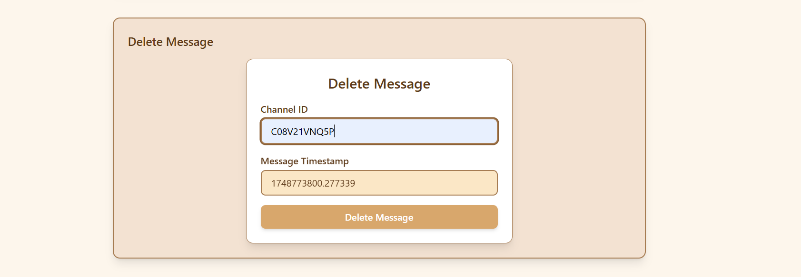

# Slack Message Manager 💬

## Login Page

  

A comprehensive solution for advanced Slack message management with scheduling, retrieval, editing, and deletion capabilities.

## ✨ Key Features

| Feature | Description |
|---------|-------------|
| ⏱️ **Schedule Messages** | Set messages to be automatically sent to any channel at specific times |
| 🔍 **Retrieve Messages** | Fetch messages from channels within custom time ranges |
| ✏️ **Edit Messages** | Update message content post-delivery using timestamps |
| 🗑️ **Delete Messages** | Remove messages cleanly while maintaining channel hygiene |
| 🤖 **Bot Interface** | Access all features through an intuitive Slack bot |

## 🖼️ Feature Showcase

### Message Scheduling

  
  
  
<em>Web interface and bot confirmation for scheduled messages</em>

### Message Retrieval

  
  
  
<em>Search by time range and view retrieved messages</em>

### Message Editing

  
  
  
<em>Edit interface and bot confirmation flow</em>

### Delete Message

  
  
  
<em>Delete interface and bot confirmation flow</em>

## 🛠️ Technical Stack

- **Backend**: Node.js, Express
- **Database**: MongoDB
- **Frontend**: React
- **APIs**: Slack Web API, Events API
- **Authentication**: OAuth 2.0

## 🚀 Getting Started

### Prerequisites
- Node.js v16+
- MongoDB Atlas cluster
- Slack workspace with admin permissions
